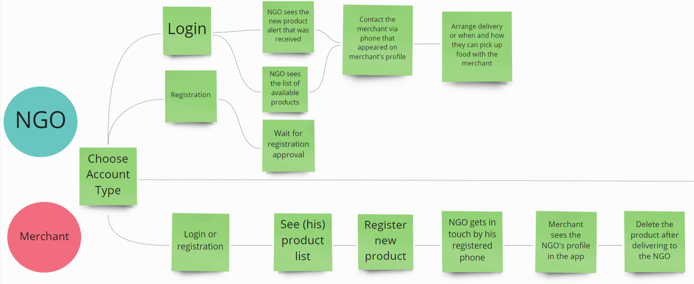

# João Food App: Fome Zero

  

<h3 align="center">Bem vindo ao João Food!</h3>

   

---

Conteúdo 

1. [Introduction](#introduction)
1. [The problem](#the-problem)
1. [Market opportunity](#Market-opportunity)
1. [Our solution](#our-solution)
1. [Authors](#authors)
1. [License](#license)

---

## Introduction

O __João Food__ é um app desenvolvido para o __Call for Code Hackathon 2021__ com o objetivo de reduzir o desperdício de alimentos contribuindo assim para a redução da fome.
O app interliga o comerciante (que chamamos de João), que trabalha em centros de abastecimento e tem que jogar fora alimentos que não foram vendidos todos os dias, e ONGs que combatem a fome, ajudando assim a alimentar pessoas famintas antes dos alimentos se tornarem inconsumíveis.

---

## The problem

- Mais de 820 milhões de pessoas passam fome no mundo;
- 127 milhões de toneladas de alimentos são jogadas fora por ano na América Latina;
- 41 mil toneladas de alimentos são jogadas fora por ano no Brasil.

Os prejuízos econômicos e ao meio ambiente estão entre as consequências desse mau funcionamento do ciclo alimentar.
A fome é a maior consequência. Ela ocorre porque, ao desperdiçar alimento, há um aumento no valor dos produtos e muitas famílias não conseguem pagar por eles. O crescimento do lixo e dos problemas ambientais também são apontados pelos especialistas como consequências dessas perdas.
No Brasil, o desperdício acontece nas seguintes etapas:

- 50%: No manuseio de transporte;
- 10%: No campo, onde a produção acontece;
- 10%: No varejo e supermercados;
- 30%: Durante a comercialização e o abastecimento.

Os maiores números são causados pelo manuseio de transporte e comercialização e abastecimento, que representam 80% das causas.

---

## Market Opportunity

We believe that our app will bring more market opportunities because the hunger has always been a concern for many nations, even more today. When we think about our national scenario, which was greatly aggravated by the pandemic. Our app will bring an innovative idea with high chances of helping people who can´t buy or have acess to food.

Central Food:

- Alleviate the hunger that was aggravated by the pandemic;
- Reduce the food waste, that has been a problem for supply centers in Brazil;
- Help NGOs receive more food to help the greatest number of people per day.

---

## Our solution

### Application systematics

1. A merchant at the supply center registers the left over food in the app (in G or KG), takes a photo of the food and informs if this is donated or sold (for a small price informed by him);

2. The app sends notifications to all NGOS; 

3. The NGO access the app and see the announced notification;

4. The interested NGOs contacts the merchant through the telephone number that appears when he/she clicks on "I want it!" and negotiates with the merchant where he/she can get the food;

5. The NGO goes to the merchant and buys or receives the food.

### The Architecture

### User Flow Simplificado   

### User Flow    

### Tecnologias Implementadas    

- Kotlin
- Flask
- Firebase
- IBM Clound Foundry

---

## Authors

* [Ana Valente](https://github.com/AnaVSSCaldeira)
* [Jack Tanaka](https://www.linkedin.com/in/jackeline-tanaka/)
* [Lucas Martins](https://github.com/lucaomartins/)
* [Marcus Mariano](https://github.com/marcusmariano)
* [Nicole Silveira Manoel](https://www.linkedin.com/in/nicole-silveira-manoel-b04b8b159/)

 
---

## License

Code and documentation are available according to the Commons Clause Version 1 (see [LICENSE](https://commonsclause.com/)).
