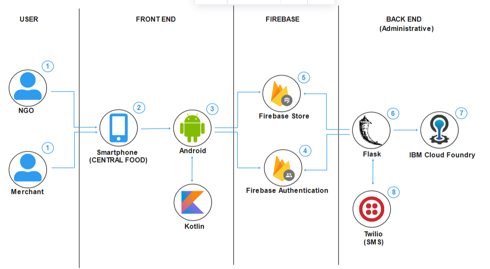
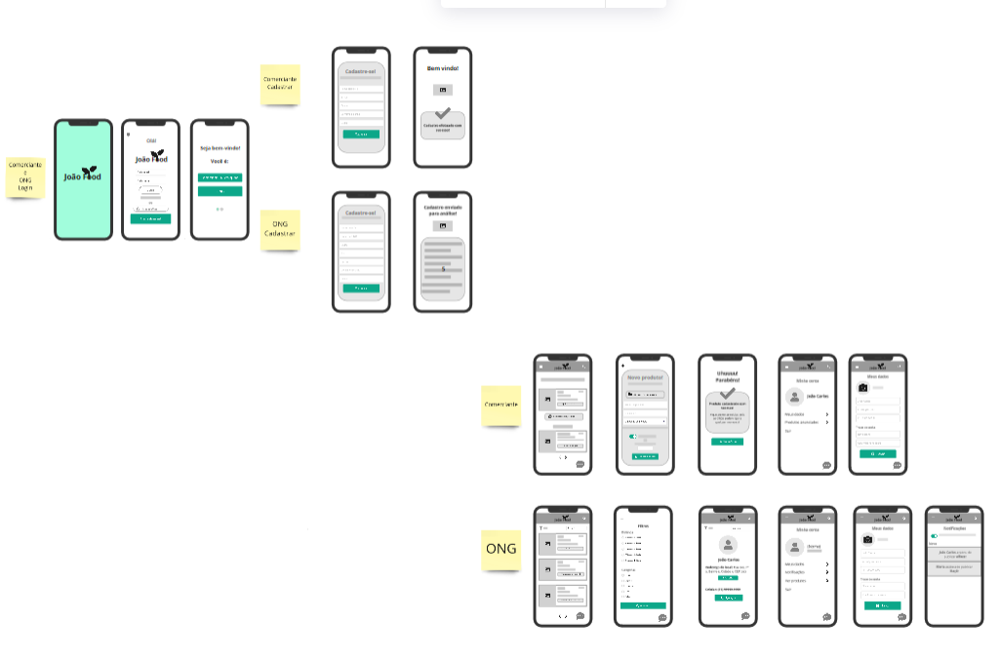

# Joao Food App: Fome Zero

Bem vindo ao [Joao Delivery](#https:/)!   

---

Conteúdo 

1. [Introdução](#introdução)
1. [O Problema](#o-problema)
1. [Oportunidade de Mercado](#oportunidade-de-mercado)
1. [Nossa Solução](#nossa-solução)
1. [Autores](#autores)
1. [License](#license)

---

## Introdução

O __João Food__ é um app desenvolvido para o __Call for Code Hackathon 2021__ com o objetivo de reduzir o desperdício de alimentos contribuindo assim para a redução da fome.
O app interliga o comerciante (que chamamos de João), que trabalha em centros de abastecimento e tem que jogar fora alimentos que não foram vendidos todos os dias, e ONGs que combatem a fome, ajudando assim a alimentar pessoas famintas antes dos alimentos se tornarem inconsumíveis.

---

## O Problema

- Mais de 820 milhões de pessoas passam fome no mundo;
- 127 milhões de toneladas de alimentos são jogadas fora por ano na América Latina;
- 41 mil toneladas de alimentos são jogadas fora por ano no Brasil.

Os prejuízos econômicos e ao meio ambiente estão entre as consequências desse mau funcionamento do ciclo alimentar.
A fome é a maior consequência. Ela ocorre porque, ao desperdiçar alimento, há um aumento no valor dos produtos e muitas famílias não conseguem pagar por eles. O crescimento do lixo e dos problemas ambientais também são apontados pelos especialistas como consequências dessas perdas.
No Brasil, o desperdício acontece nas seguintes etapas:

- 50%: No manuseio de transporte;
- 10%: No campo, onde a produção acontece;
- 10%: No varejo e supermercados;
- 30%: Durante a comercialização e o abastecimento.

Os maiores números são causados pelo manuseio de transporte e comercialização e abastecimento, que representam 80% das causas.

---

## Oportunidade de Mercado

Acreditamos que nosso app trará muitas oportunidades no mercado pois a fome sempre foi um motivo de preocupação para diversas nações, ainda mais hoje, quando pensamos no cenário nacional que foi muito agravado pela pandemia.
Nosso app trará uma ideia inovadora com altas chances de ajudar pessoas que não podem comprar comida ou ter acesso a elas.

Podemos:

- Atuar amenizando a fome que foi agravada na pandemia;
- Ajudar a diminuir o desperdício que tem sido um problema para os centros de abastecimento;
- Ajudar ONGs a receber um nível maior de alimentos para ajudar o maior número de pessoas por dia.

---

## Nossa Solução

### Sistemática do aplicativo

1. Comerciante (João) do centro de abastecimento percebe que sobrou x kg de algum alimento, e por isso cadastra os alimentos no app, tira foto do alimento e informa doado ou vendido por um preço pequeno informado por ele;

1. O app envia notificações e e-mails para todas as ONGs; 

1. A ONG entra no aplicativo e vê a oportunidade que foi anunciada;

1. A ONG entra em contato com o comerciante (João) por meio do telefone que encontrou no anúncio e negocia a busca da mercadoria;

1. A ONG vai até o comerciante (João), compra e/ou recebe a mercadoria.

### The Architecture

### User Flow    

### Tecnologias Implementadas    

- Kotlin
- Flask
- Firebase

---

## Autores

* [Ana Valente](https://github.com/AnaVSSCaldeira)
* [Jack Tanaka](https://www.linkedin.com/in/jackeline-tanaka/)
* [Lucas Martins](https://github.com/lucaomartins/)
* [Marcus Mariano](https://github.com/marcusmariano)
* [Nicole Silveira Manoel](https://www.linkedin.com/in/nicole-silveira-manoel-b04b8b159/)

 
---

## License

Code and documentation are available according to the GNU GENERAL PUBLIC LICENSE Version 3 (see [LICENSE](https://www.gnu.org/licenses/gpl.html)).
